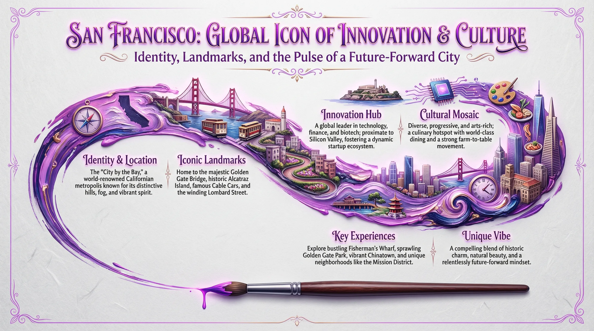

# 3D Impasto Micro-Landscape Poster: Oil Painting Pen Stroke on Xuan Paper
## Prompt Text

A pen in the process of drawing, tracing a fine line of ink. The stroke is a curved path containing a microscopic landscape. Oil painting style, academic layout poster design with master-level typography. 3D micro-landscape, impasto technique with varying thickness to create a sense of three-dimensionality. Radiant neon purple tones, minimalist top-down view, extensive white space, light gray textured Xuan paper background.

The main title features artistic calligraphy that is highly eye-catching. The subtitle complements the main title with professional-tier composition. Decorative copy is set in serif fonts, organized into integrated sections that harmonize with the headlines. Content-related embellishments are interspersed throughout. The visuals present a 3D relief effect, with the pen tip positioned at the end of the stroke. Everything outside the stroke is negative space. The background is a pure light gray. The overall style fuses modern and traditional elements. High detail, ultra-realistic, HDR.
## Reference Images

