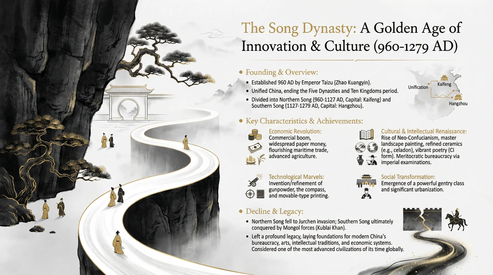

# New Chinese-style minimalist illustration
## Prompt Text

New Chinese-style minimalist illustration, hierarchical composition of dark wall and winding white path. Color palette: Black, white, and gold accents. Textures: Soft light and shadow transitions, traditional ink wash rock textures (Cunfa technique). Elements: Ancient pines, hidden courtyard, tiny figures for scale. Vibe: Ethereal, tranquil, elegant, heavy use of negative space (Liubai), zen-like atmosphere.
## Reference Images

